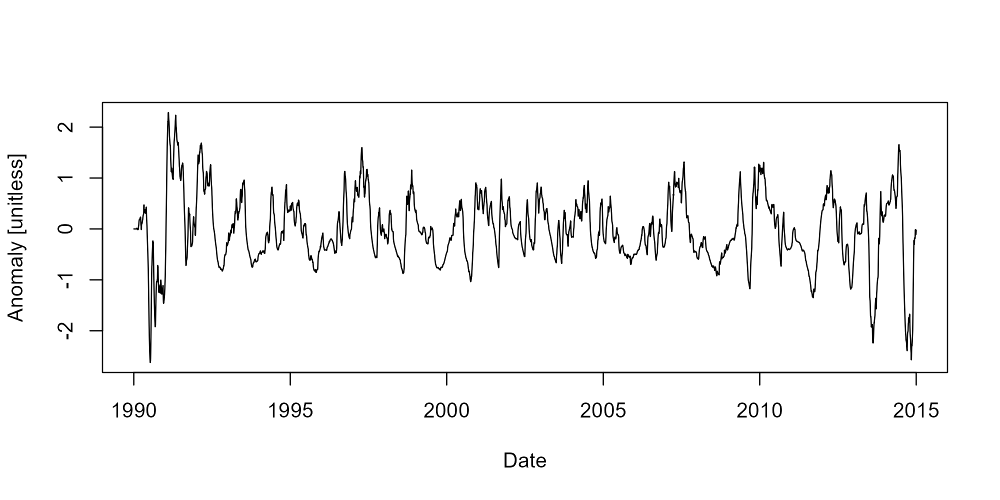

<!-- README.md is generated from README.Rmd. Please edit that file -->

# adc

<!-- badges: start -->

[](https://choosealicense.com/)
[](https://github.com/TxWRI/adc/actions)
[](https://app.codecov.io/gh/TxWRI/adc?branch=main)

<!-- badges: end -->

adc provides functions to calculate discharge-based covariates useful
for rating curve regression.

## Installation

adc is not on CRAN. Pre-built binaries can be installed from r-universe:

``` r
install.packages('adc', repos = c(txwri = 'https://txwri.r-universe.dev'))
```

## Example

Flow anomalies represent how different the current discharge period is
(current day, current week, current month, etc.) from previous periods
(previous week, previous month, period of record, etc.).

``` r
library(adc)
## example code is lavaca and includes dates and mean daily flow

data(lavaca)

x <- fa(lavaca$Flow,
        dates = lavaca$Date,
        T_1 = "1 month",
        T_2 = "1 year",
        clean_up = TRUE,
        transform = "log10")

plot(lavaca$Date, x, type = "l", xlab = "Date", ylab = "Anomaly [unitless]")
```



The packages also includes functions to calculate an exponentially
weighted discounted flow, base-flow, and rate of change for mean daily
streamflow. Functions generally work well using the `dplyr::mutate()`
function to facilitate tidy workflows.
